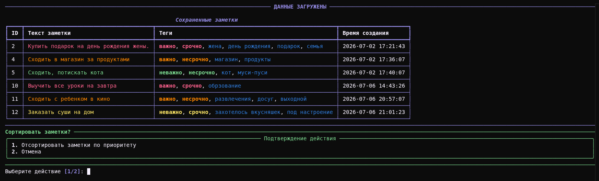
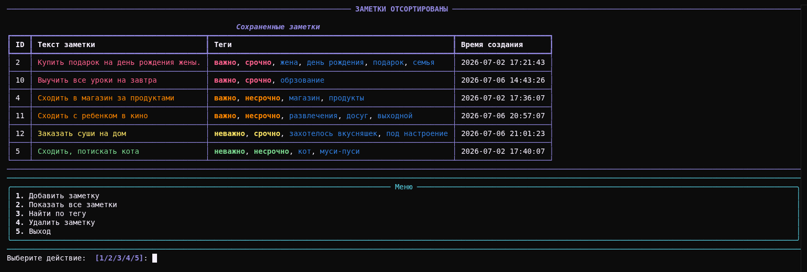

[](./LICENSE)

# 📝 Notes Manager

Консольное приложение для управления заметками с тегами, приоритетами и цветовой индикацией. Данные сохраняются в JSON, все действия логируются.

## 🎯 Возможности
- Создание заметок с текстом и произвольными тегами
- Система приоритетов с цветовой индикацией:
  - 🔴 Красный — важно + срочно
  - 🟠 Оранжевый — важно + несрочно
  - 🟡 Жёлтый — неважно + срочно
  - 🟢 Зелёный — неважно + несрочно
- Поиск по тегам — фильтрация заметок по любому тегу
- Удаление по ID с подтверждением
- Персистентность — данные сохраняются в data/notes.json
- Логирование всех действий с ротацией файлов (1 МБ, 3 бэкапа)
- Красивый UI через библиотеку Rich (таблицы, панели, цветовая разметка)

## 📸 Скриншоты





## 🛠 Технологии

- `Python 3.12` — современный синтаксис (match-case, list | None, from __future__ import annotations)
- `Poetry` — менеджер зависимостей и виртуальных окружений
- `Rich` — консольный UI (таблицы, панели, цветной вывод, Prompt с валидацией)
- `logging` — стандартная библиотека логирования с RotatingFileHandler
- `pathlib` — современный API для работы с файловой системой
- `JSON` — хранение данных с поддержкой UTF-8

## 🏗 Архитектура
Проект построен по принципу разделения ответственности:

| Модуль | Назначение |
|---|---|
| `logger.py` |  Настройка логгера: два handler'а (файл + консоль), ротация, разные уровни |
| `models.py` | Модель данных Note и хранилище NotesStorage (чтение/запись JSON) |
| `cli.py` | Консольный интерфейс: меню, ввод, вывод через Rich, Enum для режимов |

### Ключевые архитектурные решения:

- Enum `Mode` — именованные константы для режимов работы (вместо магических строк)
- TypedDict `NoteDict` — типизация структуры JSON
- Protected-атрибуты (`_storage`) — инкапсуляция внутреннего состояния
- Обработка ошибок — `FileNotFoundError` и `JSONDecodeError` при чтении файла
- Константа `FILE_PATH` — путь к файлу данных в одном месте

## 🚀 Установка
```bash
# Клонировать репозиторий
git clone https://github.com/cranberis/notes_manager.git
cd notes_manager

# Установить Poetry (если ещё не установлен)
pipx install poetry

# Установить зависимости
poetry install
```


## ▶️ Запуск

```bash
# Активировать окружение и запустить
poetry run python src/notes_manager/cli.py

# Или войти в shell и запустить
poetry shell
python src/notes_manager/cli.py
```

## 📁 Структура проекта

```
notes_manager/
├── pyproject.toml            # Конфигурация Poetry и зависимостей
├── poetry.lock               # Зафиксированные версии зависимостей
├── .gitignore                
├── README.md                 
├── src/                      
│   └── notes_manager/        
│       ├── __init__.py       
│       ├── logger.py         # Настройка логгера (RotatingFileHandler)
│       ├── models.py         # Классы Note, NotesStorage, NoteDict
│       └── cli.py            # Консольный интерфейс, main(), Enum Mode
├── data/                     # Создаётся автоматически при запуске
│   └── notes.json            # Файл с данными (в .gitignore)
├── logs/                     # Создаётся автоматически при запуске
│   └── app.log               # Логи приложения (в .gitignore)
└── tests/
    └── __init__.py
```

## 📝 Особенности реализации
### Логирование

- Два handler'а с разными уровнями:
  - Файл logs/app.log — DEBUG (все сообщения, подробный формат)
  - Консоль — INFO (только важные события, короткий формат)
- Ротация через RotatingFileHandler (1 МБ, 3 бэкапа) — логи не разрастаются
- Логирование действий: создание/удаление заметок (INFO), чтение/запись JSON (DEBUG), попытки удалить несуществующую заметку (WARNING)

### Работа с данными

- Сериализация/десериализация: Note ↔ dict ↔ JSON
- Атомарная запись: файл перезаписывается целиком при каждом изменении (не append)
- Генерация ID: max(existing_ids) + 1 — простой и надёжный способ
- Обработка ошибок: если файл пустой или повреждён — приложение не падает, начинает с пустого списка

### UI/UX

- Rich-таблицы для вывода заметок с цветовой индикацией приоритетов
- Подтверждение удаления через Confirm.ask() — защита от случайных действий
- Валидация ввода через Prompt.ask(choices=[...]) — пользователь не может ввести некорректный пункт меню
- Кроссплатформенность: clear_screen() работает и в Windows, и в Linux

### Типизация

- Полные аннотации типов для всех функций и методов
- TypedDict для структуры JSON
- Enum для режимов работы
- `from __future__ import annotations` — современный синтаксис

## 🧪 Тестирование

Тесты находятся в разработке. В будущих версиях будут добавлены unit-тесты для модулей `models.py` и `logger.py`.

Запуск тестов (когда будут готовы):
```bash
poetry run pytest
```

## 🎓 Чему я научился на этом проекте
- Работа с JSON (сериализация/десериализация)
- Логирование с ротацией файлов
- Типизация (TypedDict, Enum, Union)
- Консольный UI через Rich
- Архитектура: разделение ответственности
- Обработка ошибок (FileNotFoundError, JSONDecodeError)